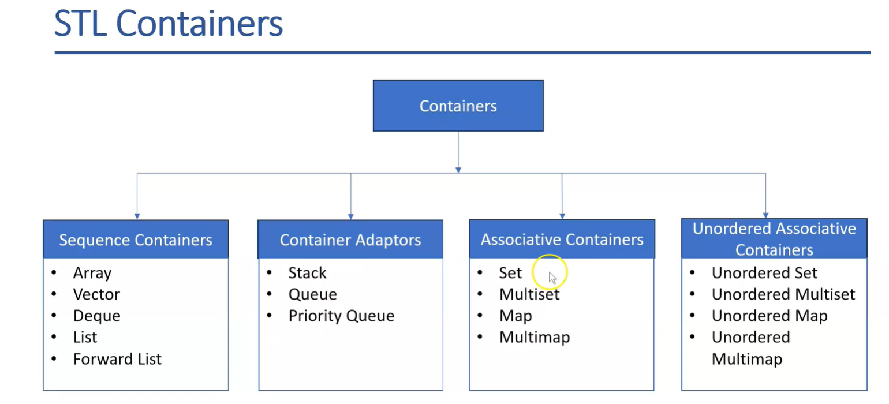

---

# 📦 C++ STL (Standard Template Library) Demo

This repository contains a C++ program demonstrating the use of various **STL containers** and **algorithms**, with multiple examples per container.

---

### ✅ **STL Components**

* **Data Structures / Containers:**
  `vector`, `list`, `queue`, `stack`, `set`, `map`

* **Algorithms:**
  Searching, sorting, transforming on container data types (e.g., `sort()`, `binary_search()`, `reverse()`)

* **Iterators:**
  Used to access and traverse container elements.
  Examples:

  * `.begin()` → points to the first element
  * `.end()` → points past the last element (non-dereferenceable)

  Iterators work similarly to pointers and are critical for container traversal.

---

## ⚠️ Note on List Iterators

In `std::list`, I tried using the `<` operator like:

```cpp
for (it = num.begin(); it < num.end(); ++it)
```

This **failed** because `std::list` provides **bidirectional iterators**, which do not support comparison operators like `<` or `>`. Only `==` and `!=` are valid.

✅ Correct form:

```cpp
for (it = num.begin(); it != num.end(); ++it)
```

---

## 📸 Demo Images



Limitations and relations between iterators and stl containers: 


Lets see more in depth examples in below sections: 

---

## 📋 Menu Overview

```
Demo number choice:
1 - array
2 - vector
3 - list
4 - stack
5 - queue
6 - set
7 - map
```

---

## ✨ Examples Included

### 1️⃣ array (`std::array`)

* Fixed-size array (`std::array<int, 5> arr`)
* `.size()`, `.at(index)`, `.empty()`
* `.front()`, `.back()`

👉 Example:

```cpp
array<int, 5> arr = {1, 24, 45, 67, 5};
cout << arr.size();
cout << arr.at(1);
cout << arr.empty();
cout << arr.front();
cout << arr.back();
```

---

### 2️⃣ vector (`std::vector`)

* Dynamic array with `.push_back()`
* `.capacity()`, `.size()`
* Normal `for` loop and iterator-based loop
* `.clear()`
* Sorting with `std::sort()`
* Binary search with `std::binary_search()`
* Reversing with `std::reverse()`
* Incrementing elements using `++*iterator`
* Finding min/max with `std::min_element()`, `std::max_element()`

👉 Example:

```cpp
vector<int> vect;
vect.push_back(20);
vect.push_back(0);
sort(vect.begin(), vect.end());
bool found = binary_search(vect.begin(), vect.end(), 30);
reverse(vect.begin(), vect.end());
```

---

### 3️⃣ list (`std::list`)

* Doubly-linked list
* Initializer list: `{1,2,3,4,5}`
* `.push_front()`, `.push_back()`
* Range-based loop and iterator-based loop
* Copying to another list: `list<int> num2(num)`

👉 Example:

```cpp
list<int> num = {1,2,3,4,5};
num.push_front(6);
num.push_back(16);
list<int> num2(num);
```

---

### 4️⃣ stack (`std::stack`)

* `.push()`, `.pop()`, `.top()`, `.size()`, `.empty()`
* No iterators available (LIFO structure)
* Copying stack before popping for safe traversal

👉 Example:

```cpp
stack<int> s;
s.push(10);
s.top();
s.pop();
stack<int> s_copy = s;
```

---

### 5️⃣ queue (`std::queue`)

* `.push()`, `.pop()`, `.front()`, `.size()`, `.empty()`
* No iterators available (FIFO structure)
* Copying queue before popping for safe traversal

👉 Example:

```cpp
queue<int> q;
q.push(10);
q.front();
q.pop();
queue<int> q_copy = q;
```

---

### 6️⃣ set (`std::set`)

* Unique, sorted elements
* Default ascending or descending (`set<int, greater<int>>`)
* `.insert()`
* Copying with constructor: `set<int> s2(s.begin(), s.end())`
* `.erase()` up to a value using iterator range

👉 Example:

```cpp
set<int> s;
s.insert(10);
set<int, greater<int>> s2(s.begin(), s.end());
s2.erase(s2.begin(), s2.find(2));
```

---

### 7️⃣ map (`std::map`)

* Key-value pairs
* `.insert(pair<key, value>)`
* `.size()`
* `.count(key)` → returns 0 or 1
* `.find(key)` → returns iterator
* Iterating over all pairs with iterators
* Searching for a key **by value** (manual loop)

👉 Example:

```cpp
map<int, string> m;
m.insert({1, "c"});
if (m.count(3)) { ... }
auto it = m.find(3);
for (auto i = m.begin(); i != m.end(); ++i) {
    if (i->second == "cuda") {
        cout << i->first;
    }
}
```

---

## 🛠️ How to Compile and Run

```bash
g++ -std=c++17 -o stl_demo stl_demo.cpp
./stl_demo
```

---

## 💡 Notes

* **array vs vector:** `std::array` is static (fixed size), `std::vector` is dynamic (resizable).
* **list vs forward\_list:** This example uses `std::list` (doubly-linked); `std::forward_list` is singly linked and forward-only.
* **stack & queue:** No iterators; access only via `.top()` / `.front()` and pop.
* **set & map:** Ordered, unique elements (or keys); can be sorted ascending or descending.

---

