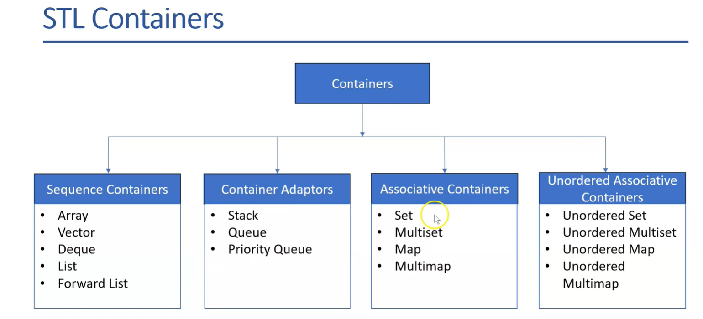
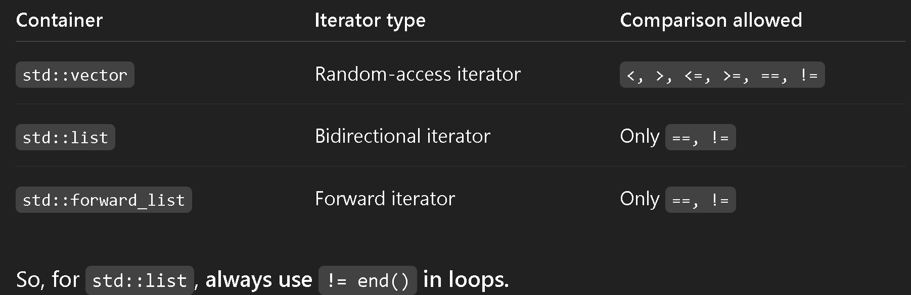

# STL 

* STL has: 
** Data structures / Containers: vetcors, list , queue, stack and maps. 

** Algorithms: searhcing, sorting and transforming on container data types.  
** Iterators: Uses to access data in containers, helping in traversing elements =  .beging(), .end() - pointing the iterator to first and last of a container. They are kind of pointers to the data in containers. 

In list, I tried using <num.end(), but it failed as this operator is not allowed

